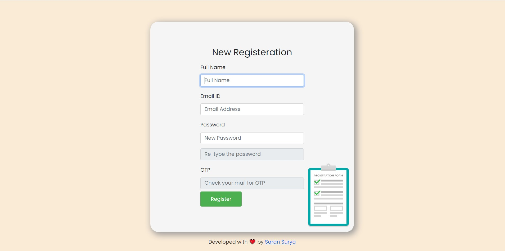
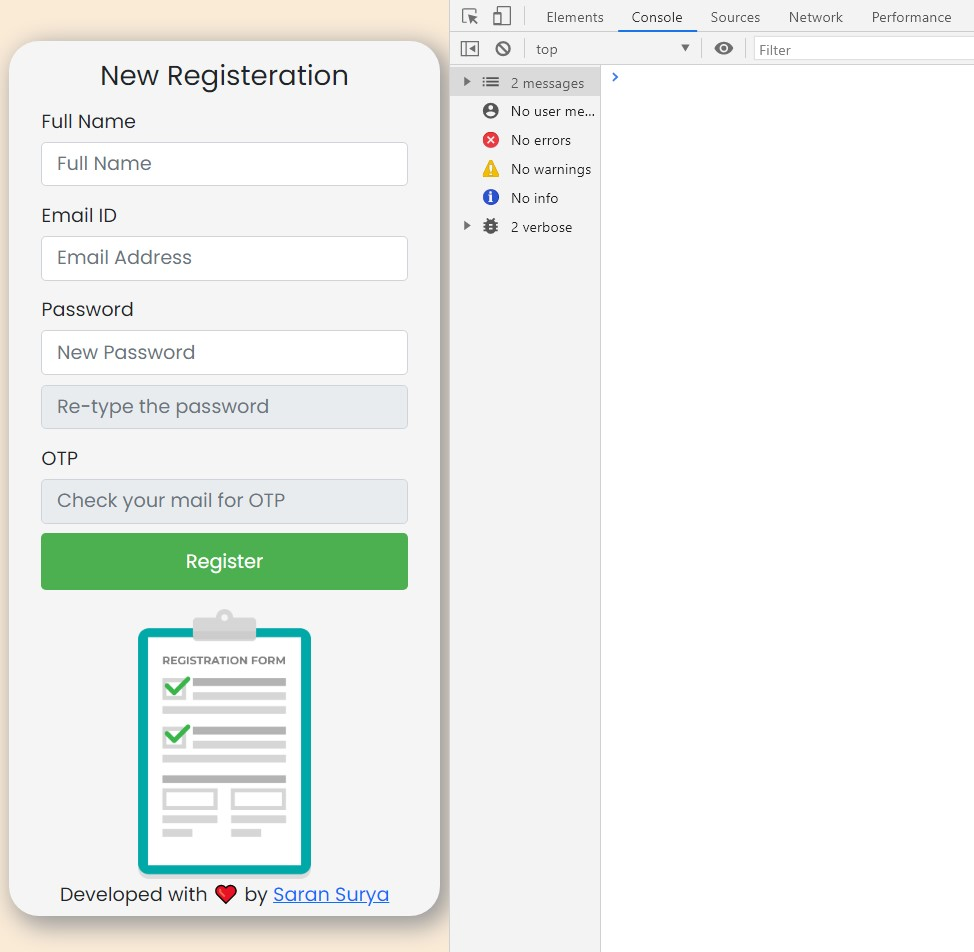
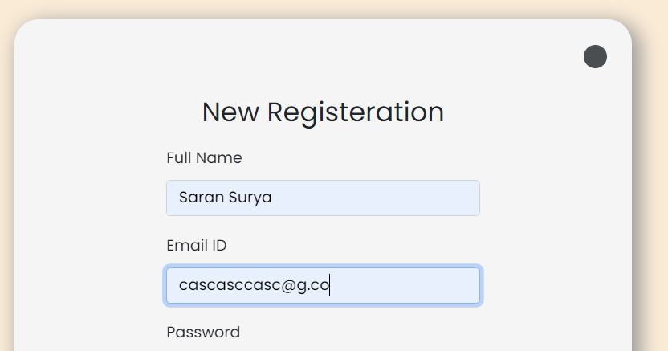
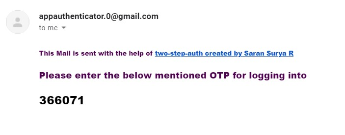
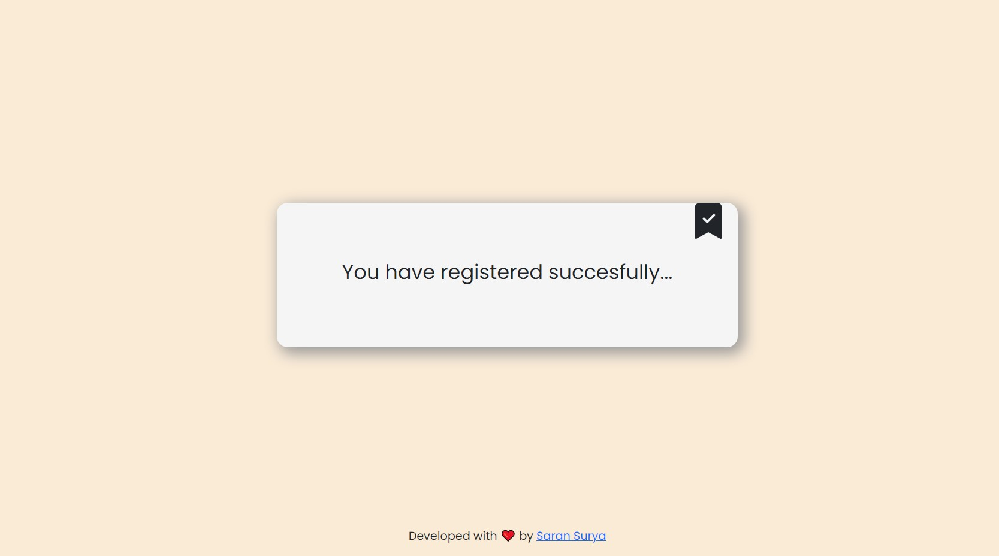
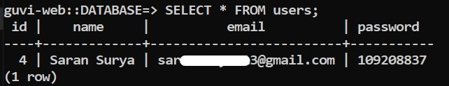

# GUVI Web Development Project

## Goal : 
#####  - To create a responsive "REGISTRATION PAGE" using HTML, SCSS, JS and BOOTSTRAP 
- ### [View the Project](https://guvi-web.herokuapp.com/)
## Key points :
  - DB is SQL and deployed using **POSTGRES**
  - The project is hosted on **HEROKU**
  - The server is built using **NODE.js**
  - I have used **OTP** verification with the help of my custom packages
    - [**two-step-auth**](https://www.npmjs.com/package/two-step-auth) *currently used by 500+ devs*
    - Other Packages :
        - [**mongo-image-converter**](https://www.npmjs.com/package/mongo-image-converter) *helpful with image uploads to MONGO DB*
        - [**certificate-gen**](https://pypi.org/project/certificate-gen/) *python*

## Features!

  - The page is responsive 
  - **Verifies email** before registering them to the Database,
  - **passwords are hashed** before sending the request to the server using a hash function
### Making xmlHttp async for better optimizations and error handling.
 - #### As we know that while we send data through xmlHttpRequests from js to the server, they might not be async, and here is how I made it work like one.
    - ##### wrapping the xmlHttpRequest inside a function that returns a PROMISE so i can await its result.
    - ```js
        function functionName(){
              //initialize promise
             return new Promise((resolve, reject)=>{
        try{
            var url = "";
            var xhttp = new XMLHttpRequest()
            xhttp.open('POST', url, true)
            xhttp.setRequestHeader('Content-Type', 'application/x-www-form-urlencoded')
            xhttp.onreadystatechange = ()=>{
                if(xhttp.readyState === 4 && xhttp.status === 201){
                    const result = JSON.parse(xhttp.response)
                    if(result.success){
                        console.log("returning true")
                        // this part will take care of returning the results.
                        resolve(true);
                    }else{
                        console.log("returning false")
                        resolve(false);
                    }
                }
            }
            xhttp.send()
            xhttp.onerror = (error)=>{
                console.log("in handler")
                reject(false)
            }
        }catch(error){
            console.log("returning false")
            reject(false)
        }
        })
        }
      ```
    - I can call the function with xmlHttpRequest like this now in async format:
    - ```js
      functionName()
      .then((result)=>{console.log(result)})
      .catch((err)=>{console.log(err.message)}  
      // a 100% async code with xmlHttpRequest
      ```
### Design Breakdown :
   - Main Home Page
     
   - Main Home Page responsive <br/>
       
   - Responsive Loaders indicating process going on in the background <br/>
     Present at the top-right corner <br/>
     
   - OTP that will be sent through the custom package mentioned above <br/>
      
   - We get a success banner stating that the registration was successful <br/>
     I have also added a fallback error banner to indicate server errors <br/>
        
   - Data on Heroku POSTGRES DataBase that saves a hashed password <br/>
     
    <br/>
# Thankyou ❤️
